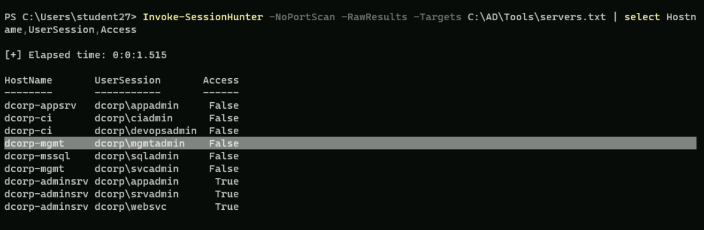

# User Hunting



Find Local group members of RDP or WinRM of the specific machine

```powershell
Get-NetLocalGroupMember -ComputerName COMPUTER_NAME -GroupName "Remote Desktop Users"
Get-NetLocalGroupMember -ComputerName COMPUTER_NAME -GroupName "Remote Management Users"
```

Find all machines on the current domain where the current user has local admin access

```powershell
# Very noisy uses SMB
Find-LocalAdminAccess -Verbose

# Very noisy
# When SMB and RPC are blocked

# Load (Uses WMI)
. C:\AD\Tools\Find-WMILocalAdminAccess.ps1
# execute

#OR

#Load(Uses WinRM)
. C:\AD\Tools\Find-PSRemotingLocalAdminAccess.ps1
# execute
Find-PSRemotingLocalAdminAccess -Verbose

#OR

# We can also use PowerShell Remoting:
Enter-PSSession -ComputerName dcorp-adminsrv.dollarcorp.moneycorp.local
$env:username
```

Find machines where a domain admin has sessions

List sessions on remote machines ([source](https://github.com/Leo4j/Invoke-SessionHunter))

```powershell
# Doesn’t need admin access on remote machines. 
# Uses Remote Registry and queries HKEY_USERS hive.
C:\AD\Tools\InviShell\RunWithRegistryNonAdmin.bat

. C:\AD\Tools\Invoke-SessionHunter.ps1

Invoke-SessionHunter -NoPortScan -RawResults | select Hostname,UserSession,Access

**command output:**

HostName       UserSession         Access
--------       -----------         ------
dcorp-appsrv   dcorp\appadmin       False
dcorp-ci       dcorp\ciadmin        False
dcorp-mgmt     dcorp\mgmtadmin      False
dcorp-mssql    dcorp\sqladmin       False
dcorp-dc       dcorp\Administrator  False
dcorp-mgmt     dcorp\svcadmin       False
us-dc          US\Administrator     False
dcorp-adminsrv dcorp\appadmin        True
dcorp-adminsrv dcorp\srvadmin        True
dcorp-adminsrv dcorp\websvc          True

or
Invoke-SessionHunter -FailSafe

To make the above enumeration more opsec friendly, no need admin privileges and avoid triggering tools like MDI, we can query specific target machines. You need to create 'servers.txt' to use the below command.
Invoke-SessionHunter -NoPortScan -Targets C:\AD\Tools\servers.txt | select Hostname,UserSession,Access
```
<figure><figcaption></figcaption></figure>

OR

```powershell
# Very noisy and needs admin privileges
Find-DomainUserLocation -Verbose
Find-DomainUserLocation -UserGroupIdentity "RDPUsers"
Find-DomainUserLocation -CheckAccess 
Find-DomainUserLocation -Stealth # less noisy, targeting file servers

```


