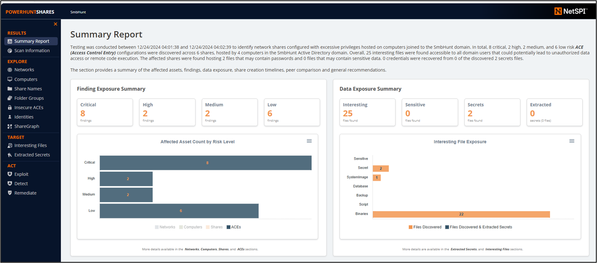
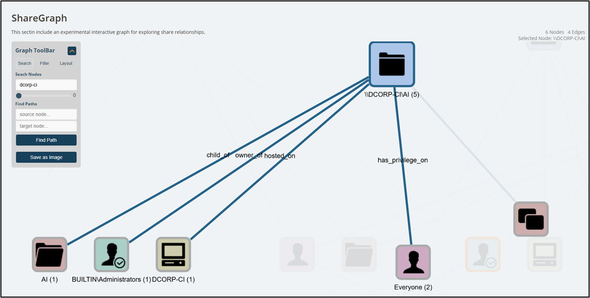

# General
📝 **Note:** import PowerView.ps1 script;)

 


### Start a PowerShell session using Invisi-Shell to avoid enhanced logging:
```batch
C:\AD\Tools\InviShell\RunWithRegistryNonAdmin.bat
```
### Get Current User
```powershell
Get-DomainUser
# Specific user by identity
Get-DomainUser -Identity student1
```
### Expand a Single Property
```powershell
Get-DomainUser | Select-Object -ExpandProperty samaccountname
```
### Select Multiple Properties (without expand)
```powershell
Get-DomainUser | Select-Object samaccountname, logoncount
```
### Get current domain
```powershell
Get-Domain
```
### To see details of the Domain Admins group:
```powershell
Get-DomainGroup -Identity "Domain Admins"
```
### enumerate members of the Domain Admins group:
```powershell
Get-DomainGroupMember -Identity "Domain Admins"
```
### enumerate members of the Enterprise Admins group
```powershell
Get-DomainGroupMember -Identity "Enterprise Admins"
Get-DomainGroupMember -Identity "Enterprise Admins" -Domain moneycorp.local
```
### Get object of another domain
```powershell
Get-Domain -Domain moneycorp.local
```
### Get domain SID for the current domain
```powershell
Get-DomainSID
```
### Get domain policy for the current domain
```powershell
Get-DomainPolicyData (Get-DomainPolicyData).systemaccess
```
### Get domain policy for another domain
```powershell
(Get-DomainPolicyData -domain moneycorp.local).systemaccess
```
### Get domain controllers for the current domain
```powershell
Get-DomainController
```
### Get domain controllers for another domain
```powershell
Get-DomainController -Domain moneycorp.local
```
### Get a list of users in the current domain
```powershell
Get-DomainUser Get-DomainUser -Identity student1
```
### Get list of all properties for users in the current domain
```powershell
Get-DomainUser -Identity student1 -Properties * Get-DomainUser -Properties samaccountname,logonCount
```
📝 **Note:**
If the logon count and the bad password count of a user is tending to 0 it might be a decoy account. If the password last set of a user was also long back it might be a decoy account.

### Search for a particular string in a user’s attributes:
```powershell
Get-DomainUser -LDAPFilter "Description=*built*" | Select name,Description
```
### Get a list of computers in the current domain
```powershell
Get-DomainComputer | select Name Get-DomainComputer -OperatingSystem "*Server 2022*" Get-DomainComputer -Ping
```
### Get all the groups in the current domain
```powershell
Get-DomainGroup | select Name Get-DomainGroup -Domain <targetdomain>
Get-ADGroup -Identity "Domain Admins"
Get-ADGroupMember -Identity "Domain Admins"
Get-ADGroupMember -Identity "Enterprise Admins"
Get-ADGroupMember -Identity "Administrators"
```
### Get all groups containing the word “admin” in group name
```powershell
Get-DomainGroup *admin*
Get-NetGroup -GroupName *admin*
Get-NetGroup -GroupName *admin* -Doamin moneycorp.local
```
**Note:** Groups like "Enterprise Admins","Enterprise Key Admins",etc will not be displayed in the above commands unless the domain is not specified because it is only available on the domain controllers of the forest root.

### Get all the members of the Domain Admins group
```powershell
Get-DomainGroupMember -Identity "Domain Admins" -Recurse
```
**Note:** Make sure to check the RID which is the last few charachters of the SID of the member-user as the name of the member-user might be different/changed but the RID is unique. For example : It might be an Administrator account having a differnt/changed member-name but if you check the RID and it is "500" then it is an Administrator account.

### Get the group membership for a user:
```powershell
Get-DomainGroup -UserName "student27"
```
### List all the local groups on a machine (needs administrator privs on non-dc machines) :
```powershell
Get-NetLocalGroup -ComputerName dcorp-dc
```
### Get members of the local group “Administrators” on a machine (needs administrator privs on non-dc machines) :
```powershell
Get-NetLocalGroupMember -ComputerName dcorp-dc -GroupName Administrators
```
### Get actively logged users on a computer (needs local admin rights on the target)
```powershell
Get-NetLoggedon -ComputerName dcorp-adminsrv
```
### Get locally logged users on a computer (needs remote registry on the target - started by-default on server OS)
```powershell
Get-LoggedonLocal -ComputerName dcorp-adminsrv
```
### Get the last logged user on a computer (needs administrative rights and remote registry on the target)
```powershell
Get-LastLoggedOn -ComputerName dcorp-adminsrv
```
### Find shares on hosts in current domain.
```powershell
Invoke-ShareFinder -Verbose
```
### Find sensitive files on computers in the domain
```powershell
Invoke-FileFinder -Verbose
```
### Get all fileservers of the domain
```powershell
Get-NetFileServer
```

### OR We can find SMB SHARES using PowerHuntShares.psm1 tool
**Note:** saved all doamin users inside a text file, and let's see anyone have read/write access in share or not. Start PowerShell new tab session using Invisi-Shell:
```powershell
C:\AD\Tools\InviShell\RunWithRegistryNonAdmin.bat
Import-Module C:\AD\Tools\PowerHuntShares.psm1
Invoke-HuntSMBShares -NoPing -OutputDirectory C:\AD\Tools\ -HostList C:\AD\Tools\<domain user file name>
```
**Note:** You need to copy the summary report to your host machine because the report needs interent access. The Summary Report page shows, well, the summary.
<figure><figcaption></figcaption></figure>

**TIP:** Go to ShareGraph -> search dcorp-ci -> Right click on dcorp-ci node -> Click expand. Tt turns out that 'Everyone' has privileges on the 'AI' folder.
<figure><figcaption></figcaption></figure>




**Note:** First Import AD Module DLL file using this command

```powershell
C:\AD\Tools\InviShell\RunWithRegistryNonAdmin.bat
Import-Module C:\AD\Tools\ADModule-master\Microsoft.ActiveDirectory.Management.dll
Import-Module C:\AD\Tools\ADModule-master\ActiveDirectory\ActiveDirectory.psd1
```

```powershell
# Enumerate all the users in the current domain using the ADModule:
Get-ADUser -Filter *

# list specific properties:
Get-ADUser -Filter * -Properties *| select Samaccountname,Description

# list all the computers:
Get-ADComputer -Filter *

# Enumerate Domain Administrators:
Get-ADGroupMember -Identity 'Domain Admins'

# Enumerate the Enterprise Administrators:
Get-ADGroupMember -Identity 'Enterprise Admins' -Server moneycorp.local

```

 


### Tasklist

```powershell
tasklist /svc
:: Search for specific string
tasklist /V | findstr svcadmin
```

### ENV variables

```powershell
set
ls env:
$env:computername
$env:username
```

### Detailed OS Information

```batch
systeminfo
systeminfo | findstr /B /C:"OS Name" /C:"OS Version" 
```

### Patches and Updates



```batch
wmic qfe get Caption,Description,HotFixID,InstalledOn 
```



```powershell
Get-HotFix | ft -AutoSize
```



### Klist

```powershell
# Get all the key list
klist
# Delete all the keys
klist purge
# Opsec safe klist. Use with loader
Rubeus.exe klist
```

### Understand Powershell or CMD

Run `asdfgh` or any arbitary string that is not a command.

* In CMD, you'll get something like:\
  `'asdfgh' is not recognized as an internal or external command...`
* In PowerShell, you'll get:\
  `The term 'asdfgh' is not recognized as...`
