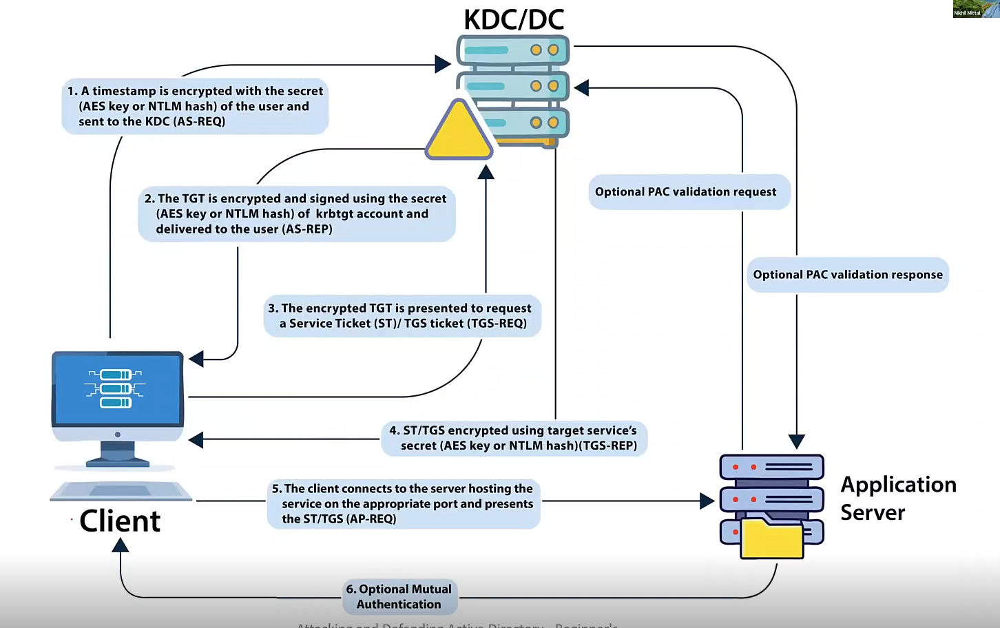

# Kerberos Authencation:

Kerberos is a ticket-based authentication protocol that enables secure communication in untrusted environments by first establishing two-party trust through a mutual third party. Kerberos requires three parties:

**Client:** The user or system requesting access to a resource.\
**Server:** The destination resource the client wants to access.\
**Key Distribution Center (KDC):** A trusted third party responsible for authenticating users and issuing tickets.

## The ticketing process

### The Kerberos authentication flow works like this:

**1. Authentication Service Request:** The client sends an authentication request encrypted with their password to the KDC.\
\
**2. Authentication Service Response:** If the KDC can decrypt the request with the user’s password, the client has proven their identity. The KDC then responds with a Ticket-Granting-Ticket (TGT), encrypted with the KDC’s secret key.\
\
**3. Ticket-Granting-Ticket Request:** The client presents the TGT back to the KDC requesting access to a destination service.\
\
**4. Ticket-Granting-Ticket Response:** If the KDC can decrypt the TGT, it proves the client presented a valid TGT, as no other entity knows the KDC’s secret key. The KDC responds with a Service Ticket (ST), encrypted with the destination service’s password.\
\
**5. Service Ticket Request:** The client passes the ST to the destination service, requesting access. If the destination service can decrypt the service ticket, it proves the ticket is valid, as only the KDC and the service itself should possess the service’s password.
<figure><figcaption></figcaption></figure>

